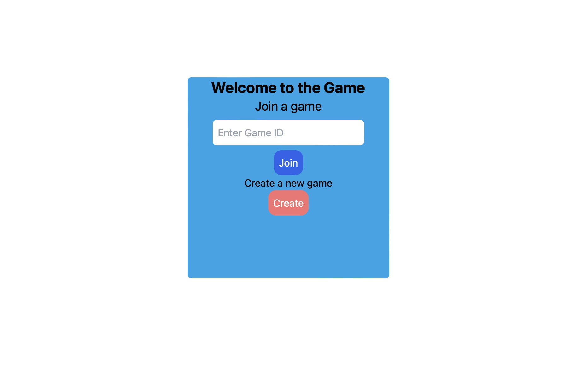
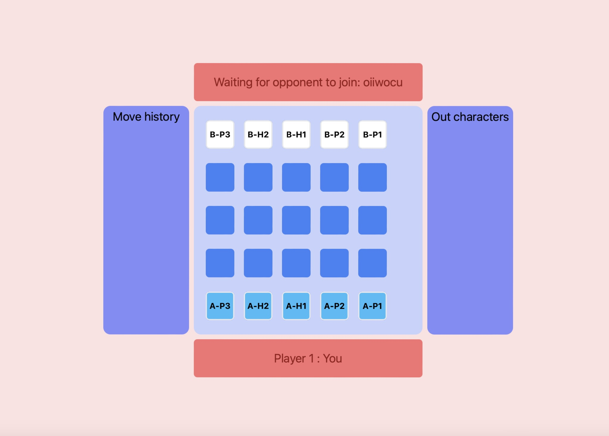
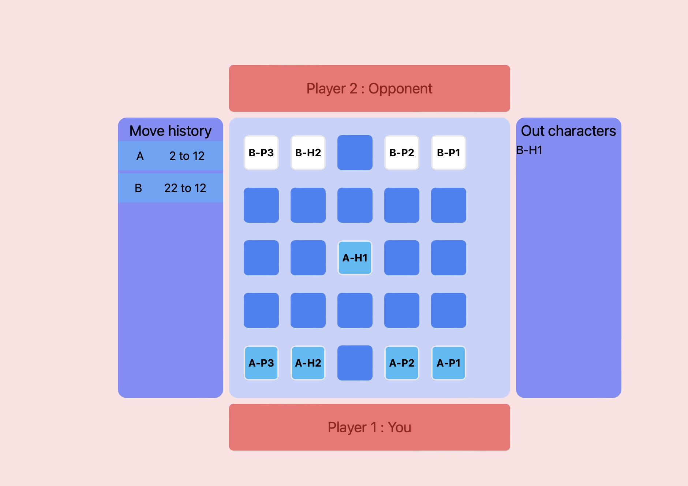

# Attack

Welcome to **Attack**, a 5x5 chess-like game built with React and Redux. This project showcases a simple yet engaging board game where two players compete to dominate the board.

## Table of Contents

- [Features](#features)
- [Installation](#installation)
- [Usage](#usage)
- [Game Rules](#game-rules)
- [Components](#components)
- [Contributing](#contributing)
- [License](#license)

## Features

- **Interactive Game Board**: A 5x5 grid where players can move their pieces.
- **Player Management**: Track player turns and scores.
- **Winner Detection**: Automatically detects and announces the winner.
- **Sound Effects**: Audio feedback for moves and errors.
- **Responsive Design**: Optimized for various screen sizes.

## Installation

To get started with the project, clone the repository and install the dependencies:

```sh
git clone https://github.com/RishiChakraborty02/RISHI21BCE3012.git
cd frontend && npm install
cd .. && cd backend && npm install
```

Usage
To run the project locally, use the following command:
Frontend->npm run dev
Backend->node app.js

This will start the development server, and you can view the game in your browser at http://localhost:5173.

Game Rules
Objective: The goal is to eliminate all opponent pieces.
Turns: Players take turns to move their pieces.
Movement: Each piece has specific movement rules.
Winning: The game ends when one player has no remaining pieces.
Components
App.jsx
The root component that initializes the game.

GamePage.jsx
The main game page that includes the game board and player components.

GameBoard.jsx
Renders the 5x5 grid and manages the game state.

TilesComponent.jsx
Represents individual tiles on the game board.

PlayerComponent.jsx
Displays player information and scores.

WinnerModal.jsx
Shows the winner announcement.

State Management
The game state is managed using Redux. The main slice of state is defined in gameSlice.js, which includes actions like makeMove, highlightTiles, and validateAndMove.

Fork the repository.
Create a new branch (git checkout -b feature-branch).
Make your changes.
Commit your changes (git commit -m 'Add some feature').
Push to the branch (git push origin feature-branch).
Open a pull request.
License
This project is licensed under the MIT License. See the LICENSE file for details.

Thank you for checking out Attack! We hope you enjoy playing the game as much as we enjoyed building it.

```

```